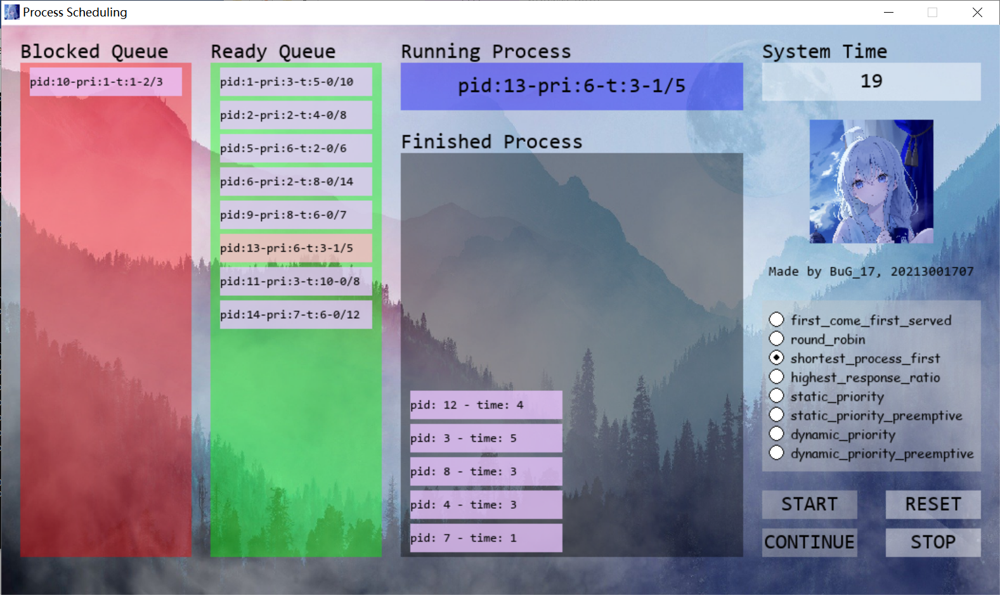

# Simulation_of_process_scheduling

Based on Pygame library, the simulation and visualization of process scheduling are realized. Through the demonstration of FCFS, RR, SPF, HRRN, SPS, DPS scheduling algorithms, the project helps in-depth understanding of these scheduling algorithms.

The entry file is process_form.py

Experimental environment:
OS: Windows_NT x64 10.0.19045
Python: 3.10.0
IDE: Visual Studio Code 1.85.1

External libraries and versions used:
pygame: 2.5.2
PySimpleGUI: 4.60.5

Appendix description:

1) dist folder: process_form subfolder contains process_form.exe executable file, you can directly open this file to generate the project form. All dependencies are listed in the folder;
2) README.md: project description file;
3) file_reader.py, PCB.py, PCBQueue.py, process_form.py, process_schedule.py: These five .py files are the project source code written in Python. The entry file is process_form.py;
4) ready_queue.txt, block_queue.txt: ready queue and blocking queue configuration files. These two profiles are loaded when the form is initialized or reset;
5) - first_come_first_served.txt: the output result file of the first come first service scheduling algorithm;
   - round_robin.txt: output result file of the time slice rotational scheduling algorithm.
   - shortest_process_first.txt: output result file of short process priority scheduling algorithm;
   - highest_response_ratio.txt: output result file of the high response ratio priority scheduling algorithm.
   - static_priority.txt: indicates the output file of the static priority scheduling algorithm (non-preemptive).
   - static_priority_preemptive.txt: indicates the output file of the static priority scheduling algorithm (preemptive).
   - dynamic_priority.txt: output result file of the dynamic priority scheduling algorithm (non-preemptive).
   - dynamic_priority_preemptive.txt: output file of the dynamic priority scheduling algorithm (preemptive).
6) bug17.ico, bug17.png, bgImage.jpeg: icon, picture (form display), and background picture of the form respectively.
